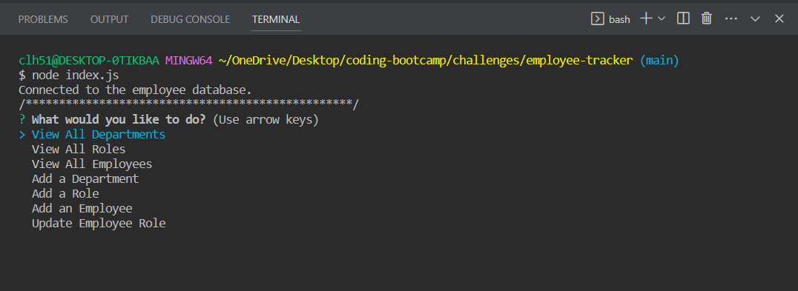
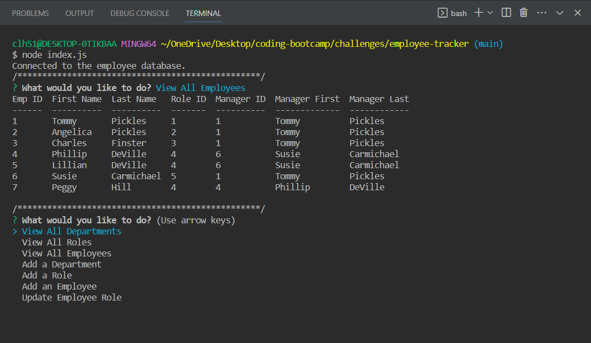
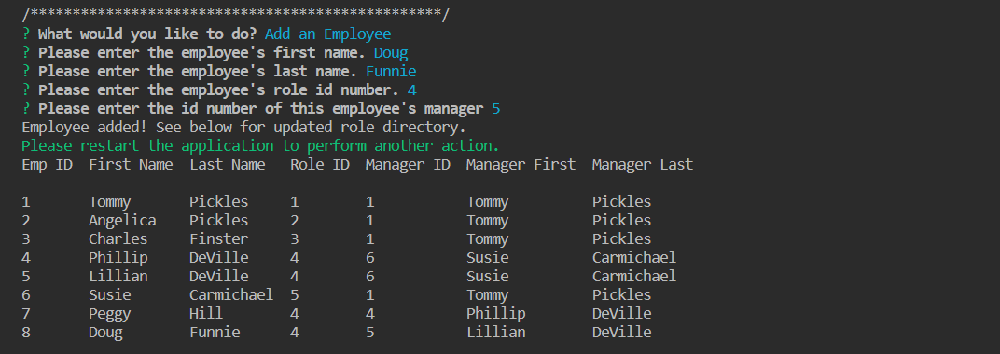

# employee-tracker

## Description

The [Employee Tracker](https://github.com/CollyLee/employee-tracker) application gives users a way to directly interact with a SQL database without needing to actually know anything about SQL coding. The different ways one might need to adjust or add to the employee data is broken apart into bite-sides actions via an Inquirer menu. I also used this application as an opportunity to practice self-joining tables, and was able to successfully self-join two instances of the employee table in order to pull the manager name next to their direct reports when the View All Employees function is called.

## Installation

No installation is necessary for the application. It can be called directly in NodeJS via the index.js file.

## Usage

Launch the program by opening the terminal in your root folder, and running "node index.js". This will kick off the initial prompt, asking what action you would like to take. 

You can view various aspects of the employee database by clicking any of the view functions. A table displaying the requested data will appear, and you'll be sent back to the initial prompt to perform another task if desired.

You can also add departments, roles, and employees via this application. It is recommended that you first run a search for the current directory so that you can refer to the current database before adding any new information. Answer the questions that you are prompted, and you will receive a confirmation that the dept/role/employee was successfully added, as well as a fresh table of the updated directory.

Please note: some of the prompts will require you to relaunch the application if you want to make further edits. If that is necessary, you will see a notification asking you to relaunch the application. Just rerun "node index.js" in order to perform more actions.